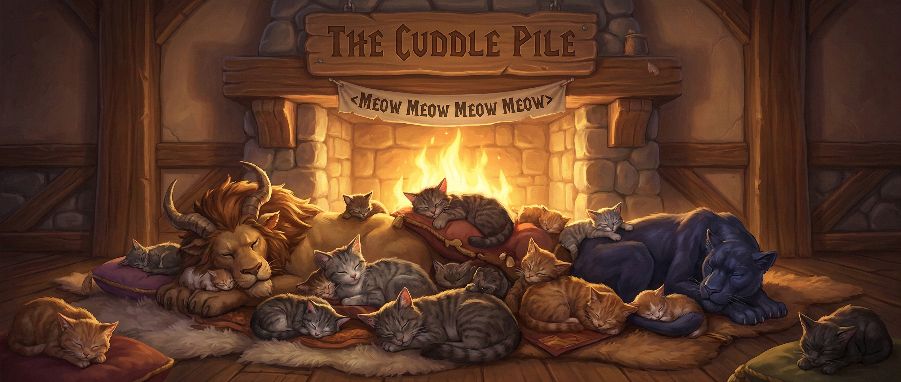
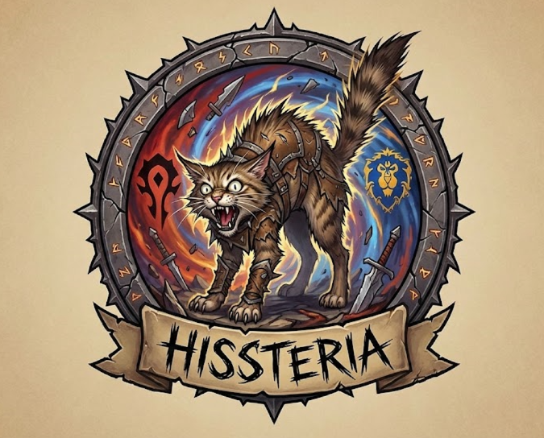

  
  # 🐾 Hissteria

  > **The Purrfect PvP Enemy Grid for WotLK 3.3.5a** ⚔️😺  
  > *Track targets, spot healers, and hunt them down with style. xoxo :3*

  
  

  

> **The Purrfect PvP Enemy Grid for WotLK 3.3.5a** ⚔️😺  
> *Track targets, spot healers, and hunt them down with style. xoxo :3*

**Hissteria** is a modern, lightweight Battleground Enemy Grid addon designed for **World of Warcraft: Wrath of the Lich King**. It gives you a clean, "Gladius-style" overview of the entire enemy team, letting you target, focus, and track cooldowns instantly.

---

## ✨ Features

Don't let your enemies hide in the tall grass. **Hissteria** sees all. 👀

* **🛡️ Premium Visuals:** Clean, dark-mode style bars with smooth textures and pixel-perfect borders. Looks like a modern retail addon!
* **📡 Smart Range Fading:** Enemies fade out when they are inactive or far away, and light up instantly when they take damage or cast spells.
* **🔮 Spec Detection:** Automatically detects enemy specializations (e.g., *Holy* vs *Retribution*) by analyzing the Combat Log for signature spells.
* **🥇 PvP Trinket Tracker:** Tracks the cooldown of the enemy's PvP Trinket (Medallion) automatically.
* **🚑 Healer Marking:** Instantly identifies Healers with a "Flash of Light" icon so you know who to focus.
* **🎯 Target Counter:** Shows how many of your teammates are currently targeting an enemy. (Red background = Kill Target!).
* **👼 Death Tracking:** Dead enemies are marked with a clear **Spirit of Redemption (Angel)** icon and dimmed out.
* **🖱️ Click-to-Kill:**
    * **Left Click:** Target Enemy 🎯
    * **Right Click:** Focus Enemy 👁️

---

## 📥 Installation

1.  Download the **Hissteria** folder.
2.  Move the folder to your WoW directory:
    `\World of Warcraft\Interface\AddOns\`
3.  (Optional) Give your cat a treat while it loads. 🐟
4.  Start the game and join a Battleground!

---

## 🎮 Slash Commands

Use `/hiss` to control the addon.

| Command | Description |
| :--- | :--- |
| `/hiss test` | **Toggle Mock Mode.** Simulates a fake battleground so you can test the UI anywhere! (Great for screenshots :3) |
| `/hiss reset` | Resets the grid position to the center of the screen. |
| `/hiss debug` | Toggles debug messages (for the curious kitties). |

---

## 🛠️ Technical Details

For the nerds (we love you):
* **Secure Frames:** Uses `SecureActionButtonTemplate` for targeting, ensuring no errors during combat.
* **Event Driven:** Heavy use of `COMBAT_LOG_EVENT_UNFILTERED` to update range and specs instantly without lag.
* **Sorting:** Automatically sorts enemies by priority: **Tanks > Healers > DPS > Dead**.

---

## 💖 Support & Feedback

If you find a bug (or a mouse), please open an Issue here on GitHub!

**Enjoy the hunt!** *xoxo, Purr :3*
